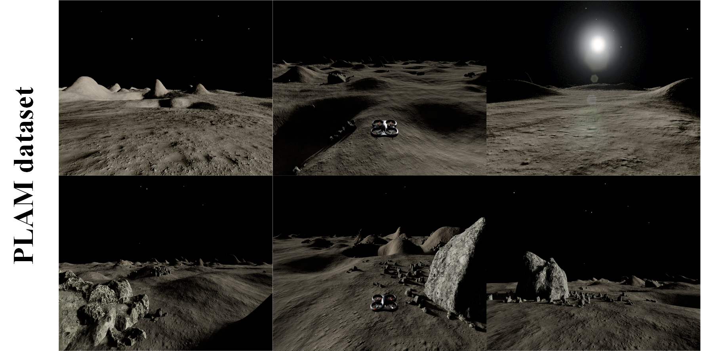
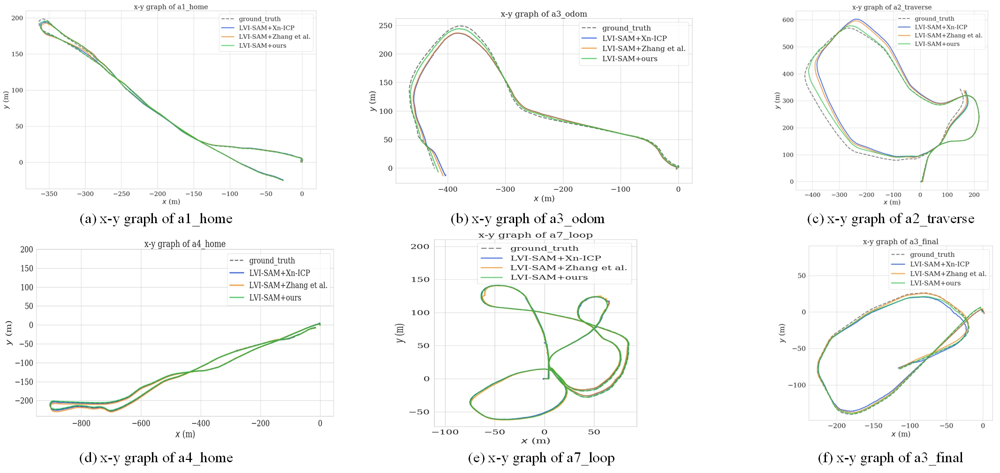

# LP-ICP
**LP-ICP: General Localizability-Aware Point Cloud Registration for Robust Localization in Extreme Unstructured Environments**

**Update (May 2025):**

This project was initially intended to be open-sourced, as mentioned in an earlier version of our paper. However, prior to resubmission, we decided not to release the project due to changes in our project plans and recent observations made during the revision process.

In our recent experiments, we observed that the use of soft constraints in partially localizable directions may introduce fluctuations and uncertainty in pose estimation. We plan to further investigate the underlying causes and explore potential improvements in future work.

**Accordingly:**
- We have removed open-source statements from the revised manuscript;
- We have informed the editor of this change in the cover letter at the time of resubmission;
- We have noted in the paper that soft constraints in partially localizable directions may introduce fluctuations and uncertainty, and that further investigation is needed to better understand and improve this in future work.

We sincerely thank everyone who showed interest in this project. We apologize for any inconvenience and appreciate your understanding.

 

   

 

  

 

